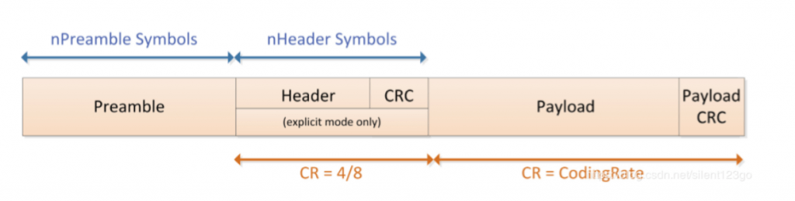

# Estrutura do código
Os arquivos são organizados no PlatformIO de tal forma:

    |
    |- .pio             //Arquivo oculto com coisas que o PlatformIO precisa para funcionar
    |--include
    |   |- PinMap.h     // Utilizado para mapear os pinos da placa LoRa
    |--src
    |   |- main.cpp     // Programa principal carregado com a função principal main()
    |- platformio.ini   // Arquivo de configuração do PlatformIO
    |- README.md        // Esse arquivo que vos fala!

* ```platformio.ini```: Configura a plataforma utilizada, a placa que será utilizada(importante para o compilador e o programador da placa saberem o que estão fazendo), o framework de trabalho e as bibliotecas externas utilizadas que seria o atributo ```lib_deps```(muito importante e utilizado)

# LoRaWAN - básico

Estrutura de pacotes do LoRaWAN

Preamble: used to keep the receiver synchronized with the incoming data stream. The default is 12 symbol lengths, and 8 symbol lengths are used in LoRaWAN

# Links úteis

* [GitHub Driver SX1276](https://github.com/RadioShuttle/SX1276GenericLib)
    - SX1276 é o transceiver de comunicação sem fio na placa B-L072LRWAN1 (nossa placa LoRa)
* [Vídeo sobre LoRaWAN Spreading Factor, Coding Rate, Potência e AirTime](https://www.youtube.com/watch?v=6fSIgRUznnk)
    - Estes atributos da transmissão/recepção são importantes e impactam a taxa de transmissão e a distância que o sinal pode percorrer
    - Importante visualização para implementação da mudança de bitrate pós touchdown do foguete
* [Calculadora de AirTime do LoRaWAN](https://www.thethingsnetwork.org/airtime-calculator)
    - Importante atentar-se: Aumentar Spreading Factor pode sim melhorar a distância em que captamos o dado, porém, para respeitar as normas de radiotransmissão, devemos nos manter com um AirTime < 400 ms
* [ECEF e LLA(Latitude, Longitude e Altitude)](https://leandrocruvinel.medium.com/uma-introdu%C3%A7%C3%A3o-%C3%A0-geolocaliza%C3%A7%C3%A3o-ecef-com-python-1ee19b089b4d)
    - Atualmente o GPS da telemetria retorna os dados de localização em ECEF, seria de muito bom proveito utilizar as coordenadas em Latitude e Longitude, esse link tem algumas explicações